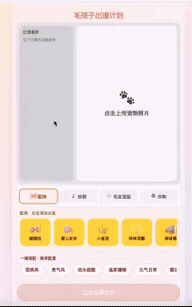

# 毛孩子出道计划

**一款面向养宠人群的"宠物穿搭 + 出道模拟"互动体验。** 迁移人类的"偶像出道"体系，让每只毛孩子都能 C 位出道。



## 产品介绍

上传一张宠物照片，自由搭配配饰 / 妆容 / 毛发造型 / 衣物，或一键选择风格方案，AI 生成出道定妆照并给出出道潜力评分 + 人设标签，最后生成可分享到社交媒体的出道文案——为养宠人群打造可交互、可传播的宠物展示体验。

### 核心玩法

**自由搭配** — 从 4 大类 29 款单品中自由挑选，打造独一无二的宠物造型：

| 分类 | 单品 |
|------|------|
| 配饰 | 蝴蝶结、爱心发夹、小皇冠、珍珠项圈、棒球帽、潮酷头巾、皮质颈饰、蕾丝发带、铃铛围脖、小花、黑框眼镜、小领结 |
| 妆容 | 腮红、眼角闪片、精致眼线 |
| 毛发造型 | 渐变毛色、温柔顺毛、朋克毛、慵懒微卷、小辫子、蓬松毛、利落短修毛 |
| 衣物 | 洛丽塔小斗篷、毛绒披肩、工装外套、软糯针织毛衣、卫衣、休闲运动套装、西装 |

**一键搭配** — 6 套精选风格方案，覆盖全部单品、零重复：

| 风格 | 搭配 |
|------|------|
| 甜美风 | 蝴蝶结 + 爱心发夹 + 腮红 + 渐变毛色 + 洛丽塔小斗篷 |
| 贵气风 | 小皇冠 + 珍珠项圈 + 精致眼线 + 温柔顺毛 + 毛绒披肩 |
| 街头甜酷 | 棒球帽 + 眼角闪片 + 潮酷头巾 + 皮质颈饰 + 朋克毛 + 工装外套 |
| 温柔慵懒 | 蕾丝发带 + 铃铛围脖 + 慵懒微卷 + 软糯针织毛衣 |
| 元气日常 | 小花 + 小辫子 + 卫衣 + 蓬松毛 + 休闲运动套装 |
| 霸总风格 | 黑框眼镜 + 西装 + 利落短修毛 + 小领结 |

**AI 出道定妆** — 基于 GPT-image-2 生成宠物穿搭效果图，自动评分并给出出道人设标签（练习生 → 本番出道）。

**社交分享** — 一键复制出道文案 + 话题标签，直接发抖音传播。

### 出道评分机制

评分基于**风格聚类算法**：将用户搭配与 6 套标准方案计算元素匹配度和风格一致性（甜美 ↔ 元气更近、贵气 ↔ 慵懒更近、甜酷和霸总风格独立），越接近某一套完整方案分数越高，风格跨度过大则扣分。

## Quick Start

```bash
# 1. 安装依赖
npm install

# 2. 环境变量
cp .env.example .env
# 无 REPLICATE_API_TOKEN 时走本地 mock（便于联调 UI）
# 真实出图需配置 Token + PUBLIC_BASE_URL（公网可访问，Replicate 需拉取图片）

# 3. 启动前后端
npm run dev
```

浏览器打开 Vite 提示的地址（默认 http://localhost:5173），不要用后端端口。

## 常用命令

| 命令 | 说明 |
|------|------|
| `npm run dev` | 同时启动前端（Vite）与后端（Express） |
| `npm run build` | 构建前端到 `client/dist` |
| `npm run build:interactive-space` | 构建 + 同步到 `index.html` + `assets/` + `interactive-space/` |
| `npm run start` | 生产态启动后端（需先 build） |

## 项目结构

```
catalog/
├── itemCatalog.json       # 单品库 + 一键搭配方案
└── debutRoles.json        # 出道角色标签池

client/                    # React 18 + Vite + Tailwind CSS
├── src/App.jsx            # dress → generating → result 三步流程
└── src/components/mobile/ # 手机壳布局组件

server/                    # Express + Multer + Replicate
├── routes/debut.js        # POST /api/debut — 出道定妆主入口
└── services/
    ├── debutScore.js      # 风格聚类评分（元素匹配 + 风格一致性）
    ├── debutRolePick.js   # 按风格 + 档位匹配角色标签
    ├── debutOutcome.js    # 组合评分 + 角色为最终输出
    └── replicateDebut.js  # GPT-image-2 生图
```

## 环境变量

| 变量 | 作用 |
|------|------|
| `REPLICATE_API_TOKEN` | Replicate API 密钥；留空走 mock |
| `PUBLIC_BASE_URL` | 公网 origin（无尾斜杠），Replicate 需访问 `/uploads/` |
| `PORT` | 后端端口，默认 3001 |
| `DEBUT_ASPECT_RATIO` | 可选 `1:1` / `3:2` / `2:3` |

## Tech Stack

**Frontend:** React 18 · Vite · Tailwind CSS
**Backend:** Express · Multer · Replicate (GPT-image-2)
**Design:** 移动端优先 · max-width 430px

---

40 小时 AI 黑客松 · 互动空间赛道 · 让每只毛孩子都有出道的机会
